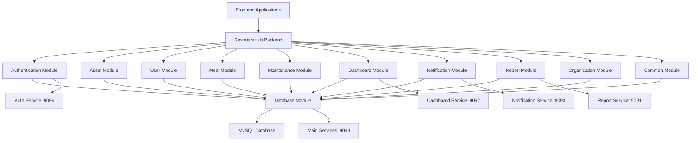

# 🏢 ResourceHub Backend

> Comprehensive resource management system built with Ballerina

[](https://ballerina.io/)
[](https://www.mysql.com/)
[](LICENSE)

A modular backend system for managing organizational resources including assets, meals, maintenance, users, and reporting with role-based access control and comprehensive analytics.

---

## 📋 Table of Contents

- [Features](#-features)
- [Architecture](#-architecture)
- [Quick Start](#-quick-start)
- [API Documentation](#-api-documentation)
- [Modules](#-modules)
- [Configuration](#-configuration)
- [Development](#-development)
- [Deployment](#-deployment)
- [Contributing](#-contributing)

---

## ✨ Features

### 🏢 **Core Functionality**
- **Asset Management** - Complete asset lifecycle and allocation tracking
- **User Management** - Role-based user accounts and authentication
- **Meal Services** - Comprehensive meal planning and request system
- **Maintenance** - Facility maintenance request and tracking system
- **Notifications** - Real-time notification system for pending requests
- **Organizations** - Multi-tenant organization management
- **Dashboard Analytics** - Real-time system monitoring and reporting

### 🔐 **Security & Authentication**
- **JWT Authentication** - Secure token-based authentication
- **Role-Based Access Control** - Admin, SuperAdmin, User, Manager roles
- **CORS Support** - Cross-origin resource sharing configuration
- **Data Privacy** - Secure data handling and user privacy protection

### 📊 **Reporting & Analytics**
- **Automated Reports** - Scheduled PDF report generation
- **Email Distribution** - Automatic report delivery
- **Multi-Module Analytics** - Comprehensive system insights
- **Real-time Dashboards** - Live system metrics and KPIs

---

## 🏗️ Architecture



### 📦 **Modular Design**
- **Independent Modules** - Each feature as a separate module
- **Shared Dependencies** - Common utilities and database access
- **Scalable Architecture** - Easy to extend and maintain
- **RESTful APIs** - Standard HTTP REST endpoints

---

## 🚀 Quick Start

### Prerequisites
- **Ballerina** 2201.12.0 or later
- **MySQL** 8.0 or later
- **Java** 17 or later

### 1. Clone Repository
```bash
git clone https://github.com/FiveStackDev/Resource_Hub-Backend-.git
cd Resource_Hub-Backend-/Ballerina
```

### 2. Database Setup
```sql
-- Create database
CREATE DATABASE resourcehub;

-- Run SQL scripts (in order)
mysql -u username -p resourcehub < resources/sql/create_database.sql
mysql -u username -p resourcehub < resources/sql/create_tables.sql
```

### 3. Configuration
Create `Config.toml` file in the project root:
```toml
# Database configuration
[ResourceHub.database]
USER = "your_db_user"
PASSWORD = "your_db_password" 
HOST = "localhost"
PORT = 3306
DATABASE = "resourcehub"

# SMTP server configuration
[ResourceHub.common]
SMTP_HOST = "smtp.gmail.com"
SMTP_USER = "your_email@gmail.com"
SMTP_PASSWORD = "your_app_password"

# API keys
[ResourceHub.report]
PDFSHIFT_API_KEY = "your_pdfshift_api_key"
```

### 4. Build and Run the Application

#### Option 1: Direct Run (Development)
```bash
# Run directly (recommended for development)
bal run

# Run with observability enabled
bal run --observability-included
```

#### Option 2: Build and Run JAR (Production)
```bash
# Build the project
bal build

# Run the built JAR file
java -jar target/bin/ResourceHub.jar
```

#### Option 3: Run with Configuration
```bash
# Run with custom config file
bal run -Cconfig=path/to/your/Config.toml
```

The services will be available at:
- **Main Services:** `http://localhost:9090`
- **Report Services:** `http://localhost:9091`
- **Dashboard Services:** `http://localhost:9092`  
- **Notification Services:** `http://localhost:9093`
- **Auth Services:** `http://localhost:9094`

### 5. Verify Installation

#### Check Service Health
```bash
# Test if services are running
curl http://localhost:9090/user
curl http://localhost:9094/auth
curl http://localhost:9092/dashboard/admin
curl http://localhost:9093/notification
curl http://localhost:9091/report
```

#### Expected Console Output
When running successfully, you should see:
```
Database connected successfully...
User management service started on port 9090
Account settings service started on port 9090
Auth service started on port 9094
Dashboard services started on port 9092
Notification service started on port 9093
Report service started on port 9091
```

---

## 📚 API Documentation

### 🌐 **Service Endpoints**

| Service | Base URL | Port | Description |
|---------|----------|------|-------------|
| 🔐 Authentication | `/auth` | 9094 | User login and token management |
| 👥 User Management | `/user` | 9090 | User CRUD operations |
| ⚙️ Account Settings | `/settings` | 9090 | User account settings and password management |
| 🏢 Asset Management | `/asset` | 9090 | Asset inventory and tracking |
| 📋 Asset Requests | `/assetrequest` | 9090 | Asset allocation requests |
| 🍽️ Meal Types | `/mealtype` | 9090 | Meal type management |
| ⏰ Meal Times | `/mealtime` | 9090 | Meal time slots |
| 📅 Meal Calendar | `/calendar` | 9090 | Meal planning and requests |
| 🔧 Maintenance | `/maintenance` | 9090 | Maintenance request system |
| 🔔 Notifications | `/notification` | 9093 | Real-time notification system |
| 📊 Admin Dashboard | `/dashboard/admin` | 9092 | Administrative analytics |
| 👤 User Dashboard | `/dashboard/user` | 9092 | User-specific dashboard |
| 🏢 Organizations | `/orgsettings` | 9090 | Organization management |
| 📊 Reports | `/report` | 9091 | Report generation |
| 📋 Report Data | `/schedulereports` | 9091 | Report data endpoints (also available on port 9090) |

### 🔐 **Authentication**
All protected endpoints require JWT token in the Authorization header:
```
Authorization: Bearer <your-jwt-token>
```

### 👥 **User Roles**
- **👤 User** - Basic access to own data and resources
- **🛡️ Admin** - Administrative access to most system functions
- **🚀 SuperAdmin** - Full system access and configuration

---

## 📦 Modules

| Module | Description | Key Features |
|--------|-------------|--------------|
| [🏢 Asset](modules/asset/Module.md) | Asset management and requests | CRUD operations, allocation tracking |
| [🔐 Auth](modules/auth/Module.md) | Authentication and authorization | JWT tokens, role-based access |
| [👥 User](modules/user/Module.md) | User management and profiles | Account management, settings |
| [🍽️ Meal](modules/meal/Module.md) | Meal planning and services | Calendar, types, time slots |
| [🔧 Maintenance](modules/maintenance/Module.md) | Maintenance request system | Priority levels, status tracking |
| [� Notification](modules/notification/Module.md) | Real-time notifications | Pending request alerts, system notifications |
| [�📊 Dashboard](modules/dashboard/Module.md) | Analytics and monitoring | Real-time stats, visualizations |
| [🏢 Organizations](modules/organizations/Module.md) | Organization settings | Multi-tenant management |
| [📊 Report](modules/report/Module.md) | Report generation | Automated PDF reports |
| [🗄️ Database](modules/database/Module.md) | Database connectivity | MySQL client, HTTP listeners |
| [🛠️ Common](modules/common/Module.md) | Shared utilities | JWT validation, email service |

---

## ⚙️ Configuration

### 🗄️ **Database Configuration**
```toml
# Database configuration
[ResourceHub.database]
USER = "username"           # Database username
PASSWORD = "password"       # Database password  
HOST = "localhost"          # Database host
PORT = 3306                 # Database port
DATABASE = "resourcehub"    # Database name
```

### 📧 **Email Configuration**
```toml
# SMTP server configuration
[ResourceHub.common]
SMTP_HOST = "smtp.gmail.com"        # SMTP server
SMTP_USER = "email@domain.com"      # Email username
SMTP_PASSWORD = "app_password"      # Email password
```

### 📊 **Report Configuration**
```toml
# API keys
[ResourceHub.report]
PDFSHIFT_API_KEY = "your_api_key"   # PDF generation service
```

### 🔐 **SSL Certificates**
Place SSL certificates in `resources/certificates/`:
- `certificate.crt` - Public certificate
- `certificate.key` - Private key
- `certificate.csr` - Certificate signing request

---

## 💻 Development

### 🛠️ **Build Commands**
```bash
# Build the project
bal build

# Clean and build
bal clean && bal build

# Build with tests
bal build --with-tests

# Run with hot reload (development mode)
bal run --observability-included

# Generate documentation
bal doc

# Run tests
bal test

# Check for compilation errors
bal check
```

### 🚀 **Running the Application**

#### Development Mode
```bash
# Quick start (recommended for development)
bal run

# With observability and debugging enabled
bal run --observability-included
```

#### Production Mode  
```bash
# 1. Build the application
bal build

# 2. Run the JAR file
java -jar target/bin/ResourceHub.jar

# Or run with custom config
java -jar target/bin/ResourceHub.jar -Cconfig=path/to/Config.toml
```

#### Docker Mode
```bash
# Build Docker image
docker build -t resourcehub-backend .

# Run container
docker run -p 9090-9094:9090-9094 resourcehub-backend
```

### 📁 **Project Structure**
```
ResourceHub-Backend/
├── 📄 Ballerina.toml          # Project configuration
├── 📄 Config.toml             # Runtime configuration (create this)
├── 📄 Dependencies.toml       # Dependency management (auto-generated)
├── 📄 main.bal               # Application entry point
├── 📁 modules/               # Feature modules
│   ├── 📁 asset/            # Asset management & requests
│   ├── 📁 auth/             # Authentication & JWT
│   ├── 📁 user/             # User management & settings
│   ├── 📁 meal/             # Meal services (types, times, calendar)
│   ├── 📁 maintenance/      # Maintenance request system
│   ├── 📁 notification/     # Real-time notifications
│   ├── 📁 dashboard/        # Analytics dashboard (admin & user)
│   ├── 📁 organizations/    # Organization settings
│   ├── 📁 report/           # Report generation & scheduling
│   ├── 📁 database/         # Database connectivity & listeners
│   └── 📁 common/           # Shared utilities & email service
├── 📁 resources/            # Static resources
│   ├── 📁 certificates/     # SSL certificates
│   └── 📁 sql/             # Database scripts
├── 📁 target/              # Build artifacts (generated)
│   ├── 📁 bin/             # Executable JAR files
│   └── 📁 cache/           # Build cache
└── 📁 tests/               # Test files
```

### 🔄 **Adding New Features**
1. Create new module in `modules/` directory
2. Define service endpoints and data models
3. Implement business logic
4. Add authentication and authorization
5. Update main.bal to include new service
6. Write comprehensive tests
7. Update documentation

---

## 🚀 Deployment

### 🐳 **Docker Deployment**
```dockerfile
FROM ballerina/ballerina:2201.12.0

COPY . /app
WORKDIR /app

RUN bal build
CMD ["java", "-jar", "target/bin/ResourceHub.jar"]

EXPOSE 9090 9091 9092 9093 9094
```

#### Build and Run with Docker
```bash
# Build Docker image
docker build -t resourcehub-backend .

# Run container
docker run -d -p 9090:9090 -p 9091:9091 -p 9092:9092 -p 9093:9093 -p 9094:9094 resourcehub-backend

# Run with volume for config
docker run -d -v $(pwd)/Config.toml:/app/Config.toml -p 9090-9094:9090-9094 resourcehub-backend
```

### ☁️ **Production Setup**
1. **Environment Variables**
   ```bash
   export RESOURCEHUB_USER="prod_user"
   export RESOURCEHUB_PASSWORD="secure_password"
   export RESOURCEHUB_HOST="db.production.com"
   ```

2. **SSL Configuration**
   - Use production SSL certificates
   - Configure HTTPS listeners
   - Enable security headers

3. **Database**
   - Use production MySQL instance
   - Configure connection pooling
   - Set up database backups

4. **Monitoring**
   - Enable Ballerina observability
   - Configure logging levels
   - Set up health checks

---

## 🤝 Contributing

### 📋 **Guidelines**
1. **Fork** the repository
2. **Create** a feature branch
3. **Follow** coding standards
4. **Write** comprehensive tests
5. **Update** documentation
6. **Submit** a pull request

### 📝 **Coding Standards**
- Follow Ballerina best practices
- Use meaningful variable names
- Write comprehensive comments
- Include error handling
- Maintain consistent formatting

### 🧪 **Testing**
```bash
# Run all tests
bal test

# Run specific module tests
bal test modules/asset

# Generate test coverage
bal test --code-coverage
```

---

## 📄 License

This project is licensed under the MIT License - see the [LICENSE](LICENSE) file for details.

---

## 👥 Team

**FiveStackDev** - Development Team
- GitHub: [@FiveStackDev](https://github.com/FiveStackDev)

### Core Contributors

- **Minul Chathumal** - [@Minulck](https://github.com/Minulck)
- **Theekshana Udara** - [@th33k](https://github.com/th33k)
- **Piumini Tishani** - [@PiuminiTishani](https://github.com/PiuminiTishani)
- **Nethminiwelgama** - [@nethminiwelgama](https://github.com/nethminiwelgama)
- **Sineth Nimhan** - [@SinethNimhan](https://github.com/SinethNimhan)

---

## � Troubleshooting

### Common Issues

#### Database Connection Issues
```bash
# Check if MySQL is running
mysql -u username -p -e "SELECT 1"

# Verify database exists
mysql -u username -p -e "SHOW DATABASES LIKE 'resourcehub'"

# Test connection with config values
mysql -u <USER> -p<PASSWORD> -h <HOST> -P <PORT> <DATABASE>
```

#### Port Already in Use
```bash
# Check what's using the ports
netstat -tulpn | grep :909

# Kill processes using the ports (Linux/Mac)
sudo lsof -ti:9090 | xargs kill -9

# For Windows
netstat -ano | findstr :9090
taskkill /PID <PID> /F
```

#### Build Issues
```bash
# Clear cache and rebuild
bal clean
bal build

# Check Ballerina version
bal version

# Update dependencies
bal pull
```

#### Configuration Issues  
- Ensure `Config.toml` is in the project root directory
- Verify all configuration sections are properly formatted
- Check that database credentials are correct
- Ensure SMTP settings are valid for email functionality

---

## �📞 Support

For support and questions:
- 📧 **Email**: minulck@gmail.com
- 📚 **Documentation**: [Project Wiki](https://github.com/FiveStackDev/Resource_Hub-Backend-/wiki)
- 🐛 **Issues**: [GitHub Issues](https://github.com/FiveStackDev/Resource_Hub-Backend-/issues)

---

<div align="center">

**⭐ Star this repo if you find it helpful! ⭐**

Made with ❤️ by FiveStackDev

</div>
